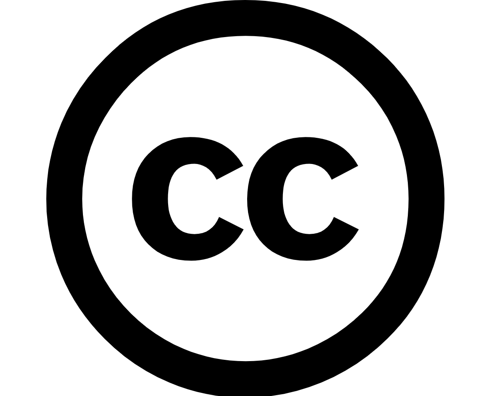

<table>
<tr>
<td>

</td>
<td>
</td>
</tr>
</table>

# Projeto: Segmentação de talhões por meio de visão computacional

# EMPRESA: A de Agro 

# BREVE DESCRIÇÃO EMPRESA / MINI BIO:
> A de Agro é uma empresa focada em se tornar a principal fonte de informações de safras do Brasil, oferecendo análises de inteligência de mercado, monitoramento e previsões para uma ampla gama de setores, incluindo bancos, empresas de crédito rural, seguradoras e outros players do agronegócio. Orientada por valores fundamentais, a empresa prioriza dados concretos sobre suposições, autonomia sobre hierarquia, entrega de valor para o cliente e trabalho em equipe para alcançar resultados.

# Grupo: *Agro é Tech*

# Integrantes:

* [Gabriel Carneiro]<gabriel.carneiro@souinteli.edu.br>
* [Gabriel Nhoncanse]<gabriel.nhoncanse@souinteli.edu.br>
* [Pedro Munhoz]<pedro.rivero@souinteli.edu.br>
* [Pedro Romão]<pedro.dias@souinteli.edu.br>
* [Sarah Ribeiro]<sarah.ribeiro@souinteli.edu.br>
* [Sergio Lucas]<sergio.lucas@souinteli.edu.br>
* [Thomas Brand]<thomas.brand@souinteli.edu.br>

# Descrição

O projeto proposto visa resolver o problema de identificação precisa dos talhões produtivos de uma fazenda na Região Sul do Brasil através de modelos de visão computacional. Este processo é crucial para realizar uma análise completa da safra de um produtor, incluindo informações sobre o que foi plantado, quando foi plantado e quanto foi colhido em cada talhão. O objetivo principal é desenvolver um modelo de visão computacional específico para identificar os talhões produtivos das fazendas na Região Sul durante uma safra determinada.

# Configuração para desenvolvimento

- Faça download do arquivo *.ipynb (jupyter notebook) chamado **Sprint_5_Colab_com_todos_processos.ipynb** [neste caminho](codigo/notebooks/SPRINT%205)
- Após isso, vá até o seu drive pessoal, carregue o arquivo no drive e abra o mesmo
- Por padrão, seu arquivo será aberto no Google Colab, que irá disponibilizar uma instância do notebook na nuvem.
- Dentro dele contém links para notebook auxiliares que devem ser baixados e abertos pelo google colab, seguindo o mesmo processo, para que se possa fazer alterações nos mesmos. Além disso, esse notebook principal contém toda a parte da rede que foi utilizada nesse módulo.

# Documentação

Os arquivos da documentação deste projeto estão na pasta [artefatos/docs](artefatos/docs).

# Artigo

Os arquivos do artigo estão na pasta [artefatos/artigo](artefatos/artigo). 

O conteúdo deste artigo foi elaborado como parte das atividades de aprendizado dos alunos, mas precisa ser revisto e modificado caso haja a intenção de submetê-lo para uma eventual publicação.

# Tags

* Sprint 5: https://github.com/Inteli-College/2024-1B-T01-CC10-G02/releases/tag/sprint5 
  * Artigo Final
  * Apresentação Final
  * Implementação Final
* Sprint 4: https://github.com/Inteli-College/2024-1B-T01-CC10-G02/releases/tag/sprint4 
  * Artigo: Refinamento com Image Segmentation
  * Implementação de Image Segmentation
* Sprint 3: https://github.com/Inteli-College/2024-1B-T01-CC10-G02/releases/tag/sprint3 
  * Artigo: Refinamento com Object Detection e Data Augmentation
  * Implementação de Object Detection
  * Implementação de Data Augmentation
* Sprint 2: https://github.com/Inteli-College/2024-1B-T01-CC10-G02/releases/tag/sprint2 
  * Artigo com Avaliação de Modelos de CNN
  * Implementação de Modelo CNN Próprio
  * Refinamento de Modelo CNN Pré-treinado
* Sprint 1: https://github.com/Inteli-College/2024-1B-T01-CC10-G02/releases/tag/sprint1
  * Draft do Artigo
  * Pipeline de Processamento e Base de Dados

# Licença

[Application 4.0 International](https://creativecommons.org/licenses/by/4.0/?ref=chooser-v1) 
 
 
