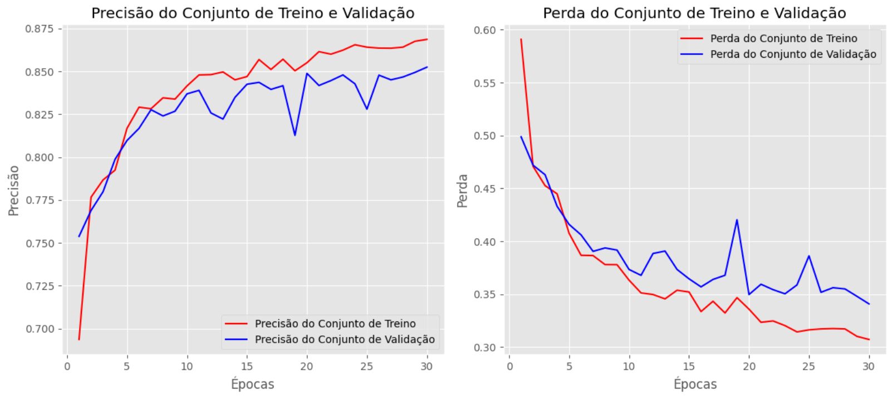
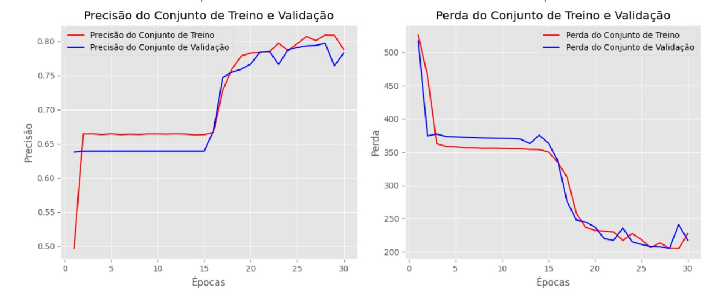

# Introdução

A capacidade do ser humano em desenvolver a agricultura foi o que permitiu com que a humanidade se desenvolvesse para o que é hoje e possa continuar evoluindo. A partir dessa habilidade, novas técnicas precisaram ser desenvolvidas ao longo da história para uma melhor administração das terras, tecnologias essas que, como elicita P. Ghadge et al.[1], podem envolver visão computacional, técnica que pode se valer de imagens de satélites e entregar ao produtor informações valiosas, como a área e segmentação das diferentes áreas produtivas (talhões) em um terreno agrícola, caso que será abordado mais detalhadamente ao longo do artigo.

Diante desse contexto, o presente artigo explora a utilização de técnicas de visão computacional, como a implementação de redes neurais como SegNet, UNet e TransUNet [2], com objetivo de segmentar precisamente as áreas produtivas agrícolas a partir de imagens de satélite.

# Materiais e Métodos

## Fontes de Dados

Foram fornecidos os seguintes arquivos, organizados na tabela:

| Nome da Pasta | Número de Arquivos | Tipo de Arquivos | Descrição dos Arquivos                                                                                                         |
| ------------- | ------------------- | ---------------- | -------------------------------------------------------------------------------------------------------------------------------- |
| bboxes        | 15                  | *.geojson        | Contém bounding boxes georreferenciados para demarcação de áreas específicas nas imagens de satélite.                      |
| human_polys   | 15                  | *.geojson        | Armazena polígonos anotados por humanos que representam áreas demarcadas como talhões agrícolas ou outras unidades.          |
| images        | 150                 | *.tif            | Inclui imagens multiespectrais do satélite Sentinel-2, cada pasta com uma coleção de bandas espectrais do satélite.          |
| marked_rgbs   | 15                  | *.png            | Apresenta imagens RGB com polígonos anotados sobrepostos para verificar precisão das anotações.                              |
| masks         | 15                  | *.png            | Contém máscaras binárias que destacam regiões de interesse nas imagens, úteis para treinamento de modelos de segmentação. |
| polys         | 15                  | *.geojson        | Polígonos anotados após aplicação de buffer e correções, mais precisos para a realidade do terreno.                        |
| rgbs          | 15                  | *_RGB.png        | Imagens RGB simplificadas das bandas multiespectrais, úteis para inspeções visuais rápidas e análises preliminares.         |
| tci_pngs      | 15                  | *_TCI.png        | Imagens em True Color Image para interpretação visual intuitiva, otimizadas para apresentações e análises visuais.          |
| tci_tifs      | 15                  | *_TCI.tif        | Arquivos TCI em formato TIFF, prontos para uso em softwares de análise geográfica e visualizações de alta fidelidade.        |


<div style="flex: 1;">
    <br>
    <p style="color: gray; font-style: italic; text-align: center;">Tabela 01 - Estrutura de dados fornecida</p>
    <br>
</div>


## Preparação e Pré-processamento de Imagens

No desenvolvimento de modelos de visão computacional para identificação e análise de talhões agrícolas, o pré-processamento de imagens desempenha um papel crucial. Visando aprimorar a qualidade das imagens e, por consequência, a assertividade dos modelos, uma série de técnicas e manipulações são tradicionalmente aplicadas.

Anteriormente, nossa abordagem incluía a aplicação de algoritmos para fusão de imagens de diferentes bandas em uma única imagem visível, além da utilização de técnicas para avaliação da qualidade da imagem e redução do espaço de cores, como o algoritmo KMeans.

No entanto, após realizar diversos testes, constatamos que os resultados obtidos não atenderam aos nossos padrões de acurácia desejados. Como resultado, decidimos revisar nossa estratégia e optamos por usar as imagens originais, cortadas em imagens de 256x256 pixeis. Também fizemos um filtro que mostra contornos na imagem para ser um canal adicional na imagem e um processo de normalização dos dados, a partir das imagens obtidas em tci_tifs. Esse último método não conseguiu ser testado mas iremos citar o desenvolvimento dele.

### Recorte de imagens

As imagens recebidas do parceiro são de 1200x1200 pixeis. Nós mudamos o tamanho para 1280x1280 e recortamos as imagens para imagens de 256x256. Após isso as imagens são salvas e passam no modelo. Este é o pseudocódigo para a esse processamento:

````
Para cada i no intervalo de 0 a len(ordered_masks) - 1:
  count = 0
  mask = Carregar imagem de '/caminho/para/máscaras/' + ordered_masks[i]
  tif = Carregar imagem de '/caminho/para/tifs/' + ordered_tifs[i]
  
  Redimensionar mask para (1280, 1280)
  Redimensionar tif para (1280, 1280)
  
  image_name = Encontrar números no nome de ordered_masks[i]
  
  Criar diretório '/caminho/para/novo_recortado/' + ''.join(image_name)
  
  Para cada row no intervalo de 0 a 4:
    Para cada col no intervalo de 0 a 4:
      Criar diretório '/caminho/para/novo_recortado/' + ''.join(image_name) + '/' + count
      
      left = col * 256
      top = row * 256
      right = left + 256
      bottom = top + 256
      
      cropped_mask = Recortar mask de (left, top, right, bottom)
      cropped_tif = Recortar tif de (left, top, right, bottom)
      
      Salvar cropped_mask como '/caminho/para/novo_recortado/' + ''.join(image_name) + '/' + count + '/mask.png'
      Salvar cropped_tif como '/caminho/para/novo_recortado/' + ''.join(image_name) + '/' + count + '/image.tif'
      
      count = count + 1
````
Pseudocódigo 01 - Código de recorte das imagens

### Pré-processamento de Imagens

Para aplicar o filtro Sobel nas imagens utilizadas, seguimos as seguintes etapas:

1. **Conversão para Escala de Cinza:** Se a imagem original estiver em formato RGB, ela é convertida para escala de cinza para reduzir a complexidade da imagem e facilitar o processamento subsequente. A conversão para escala de cinza é uma prática comum em processamento de imagem, pois reduz a complexidade computacional e pode destacar características importantes das imagens.
2. **Equalização do Histograma:** Aplicação da equalização de histograma para melhorar o contraste da imagem, redistribuindo os valores de intensidade dos pixels e realçando detalhes que podem estar obscurecidos.

3. **Gradientes de Sobel:** É uma técnica para detectar contornos em uma imagem através da aplicação de operações de convolução com duas máscaras (kernels). Utilizamos esse gradiente para ajudar o modelo a identificar contornos de talhões.

4. **Adição de canal nas imagens:** As imagens RGBs no final do processamento vão ter 4 canais: Red(Vermelho), Green(Verde), Blue(Azul) e um canal com a imagem gerada pelos gradientes de sobel.

A seguir, apresentamos o pseudocódigo que representa o processo de aprimoramento das imagens:

```
Inicializar a imagem original em RGB
Para cada imagem no conjunto de dados:
    Converter a imagem para escala de cinza
    
    Aplicar equalização de histograma na imagem em escala de cinza
    
    Aplicar os Gradientes de Sobel na imagem equalizada
    
    Adicionar os contornos a imagem original
    
    Retornar a imagem com 4 canais
```

<div style="flex: 1;">
    <br>
    <p style="color: gray; font-style: italic; text-align: center;">Pseudocódigo 02 - Código de aprimoramento das imagens</p>
    <br>
</div>

<div style="display: flex; gap: 20px; align-items: flex-start;">
    <br>
    <div style="flex: 1;">
        
        <p style="color: gray; font-style: italic; text-align: center;">Figura 01 - Imagem do satélite antes do pré processamento</p>
    </div>
    <div style="flex: 1;">
       
        <p style="color: gray; font-style: italic; text-align: center;">Figura 02 - Contorno adicionado</p>
    </div>
    <br>
</div>

Inicialmente, exploramos a fusão de imagens de diferentes bandas em uma única imagem visível e a aplicação de algoritmos como o KMeans para reduzir o espaço de cores e avaliar a qualidade das imagens. Contudo, após análises rigorosas, optamos por revisar nossa estratégia. Decidimos utilizar imagens originais, redimensionadas para 1280x1280 pixels e recortadas em patches de 256x256 pixels. Este novo enfoque não só simplificou o processamento, mas também preservou detalhes essenciais para a análise de talhões agrícolas.

Além disso, introduzimos um canal adicional nas imagens através da aplicação do filtro Sobel. Esse canal destaca os contornos das estruturas presentes nas imagens, proporcionando informações adicionais que podem ser cruciais para a identificação precisa dos talhões. Este método complementar não pôde ser completamente testado até o momento, mas representa uma próxima etapa significativa no nosso desenvolvimento.

### Augmentação e Normalização de Dados
Shorten e Khoshgoftaar (2019), em seu artigo "Image Data Augmentation for Deep Learning", exploram as diversas aplicações e benefícios da data augmentation em aprendizado de máquina. Eles destacam como essa técnica pode aumentar significativamente a quantidade de dados de treinamento de forma eficaz e econômica, permitindo que o modelo aprenda com diferentes variações dos dados originais. Essa abordagem contribui para a robustez do modelo contra variações de iluminação, a simulação de diferentes ângulos de visão e a redução do risco de overfitting, resultando em uma melhoria na precisão e robustez na detecção e classificação de imagens. [12]

Para enriquecer o conjunto de dados e aumentar a robustez do modelo contra variações encontradas no mundo real, foram implementadas técnicas de data augmentation. Este processo envolveu a aplicação de transformações geométricas, como rotações de 90 graus, translações horizontais e verticais, e inversões horizontais e verticais nas imagens. As mesmas transformações foram aplicadas às máscaras das imagens para garantir uma correspondência precisa entre as imagens e suas respectivas máscaras, proporcionando um conjunto de dados de treinamento consistente. Cada transformação ajudou a simular diferentes perspectivas e condições, ampliando a diversidade de dados disponíveis para treinamento sem a necessidade de coletar mais imagens reais. [13]

A seguir, apresentamos o pseudocódigo utilizado para a augmentação de dados:

```
Inicializar listas para imagens e máscaras aumentadas

Para cada imagem e máscara no conjunto de dados:
    
    Para cada ângulo em [0, 90, 180, 270]:
        Rotacionar a imagem e a máscara pelo ângulo atual
        Adicionar a imagem e máscara rotacionadas à lista de imagens e máscaras aumentadas

        Espelhar horizontalmente a imagem e a máscara rotacionadas
        Adicionar a imagem e máscara espelhadas à lista de imagens e máscaras aumentadas

Redimensionar todas as imagens para 600x600 pixels
Normalizar todas as imagens para valores de pixel no intervalo [0, 1]
```

<div style="flex: 1;">
    <br>
    <p style="color: gray; font-style: italic; text-align: center;">Pseudocódigo 02 - Código de augmentação de dados</p>
    <br>
</div>

Este pipeline realiza várias etapas de processamento, incluindo aprimoramento da qualidade das imagens e aplicação de diversas transformações geométricas para augmentação dos dados. Essas transformações são essenciais para aumentar a diversidade do conjunto de dados de treinamento e melhorar a capacidade de generalização do modelo.

Implementar data augmentation, juntamente com a normalização e o redimensionamento das imagens, assegura que os modelos sejam treinados com uma ampla variedade de exemplos. Isso melhora a capacidade de generalização dos modelos e seu desempenho em condições reais, resultando em um sistema mais robusto e confiável para a detecção e extração de características específicas em imagens aéreas. É válido ressaltar que demais ferramentas foram testadas, com geração de imagens através de bibliotecas e etc. Contudo, nenhum outro processo se mostrou mais efetivo, tanto quantitativamente e qualitativamente, mas também no contexto de eficiência computacional.

## Redes Neurais Convolucionais

A estrutura básica deste artigo envolverá redes neurais convolucionais (CNNs), que são um tipo especializado de redes neurais profundas projetadas especialmente para processar dados estruturados em grade, como imagens, e utilizam convolução em vez de multiplicação de matriz geral em pelo menos uma de suas camadas [4].

### Modelo base escolhido para segmentação de imagens

<div style="flex: 1;">
    
    <p style="color: gray; font-style: italic; text-align: center;">Figura 03 - Arquitetura UNet</p>
</div>

A motivação da escolha da UNet como arquitetura da rede neural de segmentação é baseada na sua capacidade de obter bons resultados com conjuntos de dados pequenos, graças a sua habilidade de generalizar padrões aprendidos [17]. Isso a torna uma escolha confiável em aplicações onde dados rotulados são escassos, como no trabalho desenvolvido no presente projeto que segmenta talhões produtivos em imagens de satélites. Além disso, como demonstra Qi, L et al.[2], a arquitetura UNet possui uma acurácia de 83% no estudo conduzido para segmentação de talhões em terrenos agrícolas, o que demonstra grande potencial para resultados satisfatórios no presente artigo. Dessa forma, por sua simples implementação e reduzido número de parâmetros em relação aos demais modelos testados em [4] - TransUnet, SegNet e DeeplabV3+, a UNet foi escolhida para implementação deste estudo com dados do satélites Sentinel-2.

### Modelo próprio implementado para segmentação de imagens

Com objetivo de segmentar os talhões produtivos, foi desenvolvido um modelo próprio que parte da UNet com o modelo pré-treinado MobileNetV2, o qual tem sua arquitetura evidenciada a seguir.

#### Arquitetura do modelo

Na camada de entrada do modelo, são esperadas imagens de 256x256 pixels como input, a fim das convoluções serem bem-sucedidas.

O encoder do modelo será baseado no resultado do estudo conduzido com modelos pré-treinados na seção Estudo de Hiperparâmetros - Transfer Learning. 

O decoder é proveniente de 3 camadas do UNet, que se conectam com as camadas oriundas do encoder. 

A estrutura da rede adotada pode ser vislumbrada no pseudocódigo a seguir:

    funcao construir_modelo()
        // Definir a entrada do modelo
        inputs = Input(shape = self.input_shape)
        reg = L2(self.val_reg)

        // Encoder (caminho de contração)
        base_model = MobileNetV2(weights = 'imagenet', include_top = falso, input_tensor = inputs)
        base_model.trainable = falso

        // Extrair camadas específicas para conexões
        conv2 = base_model.get_layer('block_1_expand').output
        conv3 = base_model.get_layer('block_3_expand').output
        decoded = base_model.get_layer('block_6_expand').output

        // Decoder (caminho de expansão)
        up5 = Conv2DTranspose(self.num_filters[2], (2, 2), strides = (2, 2), padding = 'same')(decoded)
        merge5 = concatenate([conv3, up5], axis = 3)
        conv5 = Conv2D(self.num_filters[2], self.kernel_size, activation = 'relu', padding = 'same')(merge5)
        conv5 = Conv2D(self.num_filters[2], self.kernel_size, activation = 'relu', padding = 'same')(conv5)

        up6 = Conv2DTranspose(self.num_filters[1], (2, 2), strides = (2, 2), padding = 'same')(conv5)
        merge6 = concatenate([conv2, up6], axis = 3)
        conv6 = Conv2D(self.num_filters[1], self.kernel_size, activation = 'relu', padding = 'same')(merge6)
        conv6 = Conv2D(self.num_filters[1], self.kernel_size, activation = 'relu', padding = 'same')(conv6)

        up7 = Conv2DTranspose(self.num_filters[0], (2, 2), strides = (2, 2), padding = 'same')(conv6)
        conv7 = Conv2D(self.num_filters[0], self.kernel_size, activation = 'relu', padding = 'same')(up7)
        conv7 = Conv2D(self.num_filters[0], self.kernel_size, activation = 'relu', padding = 'same')(conv7)

        outputs = Conv2D(1, (1, 1), activation = 'sigmoid')(conv7)  // Saída com um canal (máscara binária)

        threshold_output = ThresholdLayer()(outputs)

        modelo = Model(inputs = inputs, outputs = outputs)

        retornar modelo
    fim funcao
<div style="flex: 1;">
    <br>
    <p style="color: gray; font-style: italic; text-align: center;">Pseudocódigo 03 - Arquitetura do modelo próprio</p>
    <br>
</div>

Cabe ressaltar que o detalhamento da utilização de cada hiperparâmetro dessa arquitetura será explorado na seção Estudo de Hiperparâmetros, a fim de justificar a utilização das técnicas utilizadas.

Por fim, têm-se que a função de perda utilizada foi uma combinação entre a **Binary Cross-Entropy**, **Dice-loss** e um coeficiente de penalidade.

#### Funções de Perda

##### Binary Cross-Entropy

A Binary Cross-Entropy, ou entropia cruzada binária, é uma função de perda utilizada em classificações binárias. Ela compara a distribuição de probabilidade prevista pelo modelo contra a distribuição real dos rótulos (geralmente 0 ou 1), calculando o logaritmo da probabilidade prevista para cada classe correta e somando os valores negativamente [6]

$$
L(y, p) = -\frac{1}{N} \sum_{i=1}^{N} [y_i \log(p_i) + (1 - y_i) \log(1 - p_i)]
$$

<div style="flex: 1;">
    <p style="color: gray; font-style: italic; text-align: center;"> Equação 01 - Cálculo de Bynary Cross-Entropy</p>
</div>

A importância dessa função deriva de sua capacidade de fornecer uma avaliação contínua da precisão das previsões, penalizando fortemente as previsões incorretas que são feitas com alta certeza.

##### Dice-loss

Foi implementada em adição à Binary Cross-Entropy a **Dice-loss** para melhorar a precisão na segmentação dos talhões. O coeficiente de Dice é uma métrica que mede a similaridade entre as previsões do modelo e os valores verdadeiros, sendo particularmente útil em tarefas de segmentação de imagens. Ao contrário de métricas tradicionais, o coeficiente de Dice é mais sensível a pequenas regiões segmentadas incorretamente, o que é crucial para a precisão na delimitação dos talhões.

A Dice-loss é definida como *1 - coeficiente de Dice*. Isso significa que, enquanto o coeficiente de Dice(mostrado na imagem abaixo) busca maximizar a sobreposição entre as previsões e os valores verdadeiros, a Dice-loss busca minimizar essa sobreposição incorreta, incentivando o modelo a fazer previsões mais precisas.

<div style="flex: 1;">
    
    <p style="color: gray; font-style: italic; text-align: center;">Figura 04 - Imagem do cálculo de coeficiente Dice-loss</p>
</div>

##### Coeficiente de penalidade

Em adição às funções de perdas citadas, foi adicionada uma penalidade adicional na função de perda combinada, como uma forma de controlar a função de perda e fornecer mais hiperparâmetros ao modelo. Vale destacar que a relevância de cada componente da perda combinada possui um fator multiplicativo, responsável por controlar a importância de cada parte da função.

Ao incorporar a Dice-loss na função de perda combinada do modelo, juntamente com a perda de entropia cruzada binária e uma penalidade adicional, foi possível criar uma função de perda robusta que equilibra diferentes aspectos da previsão. Este equilíbrio ajuda o modelo a aprender de forma mais eficaz, melhorando a qualidade da segmentação dos talhões em imagens de satélite de terrenos agrícolas.

## Transfer Learning

O fluxo para a implementação do transfer learning é demostrado na imagem abaixo:

<div style="flex: 1">
    
    <p style="color: gray; font-style: italic; text-align: center;">Figura 05 - Diagrama do Transfer Learning</p>
</div>

Inicialmente, seleciona-se um modelo pré-treinado que foi treinado em um grande conjunto de dados para uma tarefa relacionada. Esse modelo serve como uma base de conhecimento inicial, capturando padrões gerais e características relevantes para várias tarefas. As camadas desse modelo pré-treinado aprenderam representações hierárquicas de características a partir dos dados de entrada.

Em seguida, identifica-se as camadas dentro do modelo pré-treinado que são mais propensas a capturar informações genéricas, úteis tanto para a tarefa original, quanto para a nova. Geralmente, essas camadas estão localizadas próximas ao topo da rede e tendem a aprender informações de baixo nível.

O próximo passo é o ajuste fino, onde utiliza-se o conjunto de dados da nova tarefa para ajustar as camadas selecionadas do modelo pré-treinado. Durante esse processo, permite-se que o modelo modifique seus parâmetros para melhor se adaptar às demandas específicas da nova tarefa. O objetivo principal é preservar o conhecimento prévio adquirido durante o pré-treinamento, enquanto permite-se que o modelo se adapte aos novos requisitos e, para isso, as camadas do modelo pré-treinado serão congeladas.

É importante aplicar técnicas de regularização durante o ajuste fino para evitar overfitting nos dados de treinamento da nova tarefa. Isso pode incluir o uso de técnicas como dropout, regularização L1/L2 e ajuste cuidadoso da taxa de aprendizado.

Após o ajuste fino, avalia-se o desempenho do modelo na nova tarefa usando conjuntos de validação e teste. Com base nos resultados da avaliação, podem ser feitos ajustes adicionais no modelo, como mudanças na arquitetura, hiperparâmetros ou no próprio processo de ajuste fino.

O procedimento detalhado acima pode ser visto de forma aplicada em "Estudo de Hiperparâmetros".

## Estudo de Hiperparâmetros

Tendo em vista o objetivo de implementar melhorias ao modelo de segmentação desenvolvido, diferentes métricas foram estudadas de forma independente, com o intuito de verificar qual é a melhor configuração do recurso em questão. Como demonstrado a seguir, foram estudados diferentes recortes no modelo pré-treinado para o Transfer Learning, diferentes parâmetros de Dropout e distintos valores para o regularizador.

### Transfer Learning

O estudo se deu, inicialmente, com o modelo pré-treinado VGG-16 [16]. Por meio da biblioteca do Keras e com a GPU do Google Colaboratory, foram conduzidos experimentos com diferentes recortes no VGG-16, para que fosse verificada a ocorrência de melhorias na performance do modelo UNet já desenvolvido no presente artigo. Para tal, foi analisada a estrutura do VGG-16, como mostrada na tabela a seguir:

| Layer (type)               | Output Shape                    | Param #                       |
| -------------------------- | ------------------------------- | ----------------------------- |
| input_3 (InputLayer)       | (None, None, None, 3)           | 0                             |
| block1_conv1 (Conv2D)      | (None, None, None, 64)          | 1792                          |
| block1_conv2 (Conv2D)      | (None, None, None, 64)          | 36928                         |
| block1_pool (MaxPooling2D) | (None, None, None, 64)          | 0                             |
| block2_conv1 (Conv2D)      | (None, None, None, 128)         | 73856                         |
| block2_conv2 (Conv2D)      | (None, None, None, 128)         | 147584                        |
| block2_pool (MaxPooling2D) | (None, None, None, 128)         | 0                             |
| block3_conv1 (Conv2D)      | (None, None, None, 256)         | 295168                        |
| block3_conv2 (Conv2D)      | (None, None, None, 256)         | 590080                        |
| block3_conv3 (Conv2D)      | (None, None, None, 256)         | 590080                        |
| block3_pool (MaxPooling2D) | (None, None, None, 256)         | 0                             |
| block4_conv1 (Conv2D)      | (None, None, None, 512)         | 1180160                       |
| block4_conv2 (Conv2D)      | (None, None, None, 512)         | 2359808                       |
| block4_conv3 (Conv2D)      | (None, None, None, 512)         | 2359808                       |
| block4_pool (MaxPooling2D) | (None, None, None, 512)         | 0                             |
| block5_conv1 (Conv2D)      | (None, None, None, 512)         | 2359808                       |
| block5_conv2 (Conv2D)      | (None, None, None, 512)         | 2359808                       |
| block5_conv3 (Conv2D)      | (None, None, None, 512)         | 2359808                       |
| block5_pool (MaxPooling2D) | (None, None, None, 512)         | 0                             |
|                            | **Total params:**         | **14714688 (56.13 MB)** |
|                            | **Trainable params:**     | **14714688 (56.13 MB)** |
|                            | **Non-trainable params:** | **0 (0.00 Byte)**       |

<div style="flex: 1;">
    <br>
    <p style="color: gray; font-style: italic; text-align: center;">Tabela 02 - Camadas, formatos e parâmetros do VGG16</p>
    <br>
</div>

Sabendo que o modelo pré-treinado substitui o encoder do UNet existente e é necessário que haja a conexão com o decoder da rede, foram selecionadas 4 camadas convolucionais nos diferentes testes, com o intuito de preservar a arquitetura prévia do decoder. Sendo assim, os seguintes testes de performance foram realizados:

1) - Conv1 = 'block1_conv2'
   - Conv2 = 'block2_conv2'
   - Conv3 = 'block3_conv3'
   - Decoded = 'block4_conv3'
2) - Conv1 = 'block1_conv2'
   - Conv2 = 'block2_conv2'
   - Conv3 = 'block3_conv2'
   - Decoded = 'block4_conv2'

A conexão com o decoder ocorre como no pseudocódigo a seguir:

    # Carregar o modelo pré-treinado VGG16 sem as camadas totalmente conectadas
    base_model = VGG16(weights='imagenet', include_top=False, input_tensor=Input(shape=(224, 224, 3)))

    # Congelar as camadas do modelo pré-treinado
    for layer in base_model.layers:
        layer.trainable = False
          
    // Extrai saídas intermediárias das camadas convolucionais do VGG16
    tensor conv1 = base_model.get_layer('block1_conv2').output
    tensor conv2 = base_model.get_layer('block2_conv2').output
    tensor conv3 = base_model.get_layer('block3_conv2').output
    tensor decoded = base_model.get_layer('block4_conv2').output

    // Inicia o decoder (caminho de expansão)
      tensor up5 = Conv2DTranspose(num_filters[2], (2, 2), strides=(2, 2), padding='same')(decoded)
      tensor merge5 = concatenar([conv3, up5], axis=3)
      tensor conv5 = Conv2D(num_filters[2], kernel_size, activation='relu', padding='same')(merge5)
      conv5 = Conv2D(num_filters[2], kernel_size, activation='relu', padding='same')(conv5)

    tensor up6 = Conv2DTranspose(num_filters[1], (2, 2), strides=(2, 2), padding='same')(conv5)
      tensor merge6 = concatenar([conv2, up6], axis=3)
      tensor conv6 = Conv2D(num_filters[1], kernel_size, activation='relu', padding='same')(merge6)
      conv6 = Conv2D(num_filters[1], kernel_size, activation='relu', padding='same')(conv6)

<div style="flex: 1;">
    <br>
    <p style="color: gray; font-style: italic; text-align: center;">Pseudocódigo 04 - Conexão com o Decoder</p>
    <br>
</div>

Cabe ressaltar que foram configuradas 30 épocas de treinamento somente com a arquitetura UNet original, sem nenhuma incorporação de recursos como Early Stopping, Dropout, Limiarização, Pruning ou a função de perda combinada com a Dice Loss, com o objetivo de testar somente a relevância do Transfer Learning.

Em segundo plano, foi gerada uma comparação com 4 testes realizados com o modelo MobileNetV2 [17]. Os testes seguiram o mesmo formato citado anteriormente, com a escolha de camadas combinadas aleatoriamente entre o primeiro e o sexto bloco, sendo que a foi necessário selecionar o primeiro bloco como inicial e o sexto como o último para a conexão com o decoder ser bem-sucedida. Os testes foram:

1) - Conv2 = 'block_1_expand_relu'
   - Conv3 = 'block_3_expand_relu'
   - Decoded = 'block_6_expand_relu'
2) - Conv2 = 'block_1_expand'
   - Conv3 = 'block_3_expand'
   - Decoded = 'block_6_expand'
3) - Conv2 = 'block_1_expand_relu'
   - Conv3 = 'block_2_expand_relu'
   - Decoded = 'block_6_expand_relu'
4) - Conv2 = 'block_1_expand'
   - Conv3 = 'block_2_expand'
   - Decoded = 'block_6_expand'

A conexão com o decoder se dá de forma idêntica ao teste com o modelo VGG-16.

### Dropouts

Para determinar o valor ideal de dropout a ser utilizado no modelo de segmentação, foram realizados 7 testes no total, com valores de dropout de 0.1, 0.2, 0.3, 0.4, 0.5, 0.6 e 0.7.

Cada teste consistiu no treinamento de 4 modelos independentes de segmentação, utilizando o valor de dropout específico daquele teste. Ao final do treinamento e validação, foram coletadas as métricas de acurácia, perda, IoU (Intersection over Union) e COVR (Coverage Rate) dos 4 modelos. Em seguida, calculou-se a média dessas métricas, resultando nos valores finais para cada parâmetro de dropout testado.

Além disso, para evitar qualquer possível viés nos testes, foram retirados quaisquer outros hiperparâmetros/configurações extras, como dice loss, regularização, etc., deixando somente o modelo(baseado na arquitetura U-net) que é usado para segmentação.

Por fim, para o teste de diferentes valores de dropout, o valor a ser testado era passado no parâmetro "dropout_rate" na chamada do contrutor da classe Unet, assim definindo a taxa de dropout que seria usada naquele modelo.

### Regularizers

Para determinar o valor ideal do regularizer a ser utilizado no modelo de segmentação, foi realizado um Grid Search com 6 valores de regularizer: 0,00001, 0,0001, 0.001, 0.01, 0.1 e 1.0

Após o término do treinamento e validação, as métricas de acurácia e perda foram registradas para cada um dos 5 valores de regularizer. Em seguida, calcularam-se as médias dessas métricas, resultando nos valores finais para cada nível de regularizer testado.

Para garantir que os resultados fossem precisos e não viesados, todos os outros hiperparâmetros e configurações adicionais, como dropout, dice loss, etc, foram removidos, mantendo apenas o modelo base (arquitetura U-Net) para segmentação.

Durante a execução da grid search, o valor de regularizador a ser testado era passado no parâmetro "regularizer_rate" na chamada do construtor da classe Unet, definindo a taxa de regularização para aquele modelo específico. Os resultados dos diferentes valores de regularizador foram comparados através de um gráfico, demonstrando o impacto desses valores na acurácia e na perda do modelo.


## Resultados obtidos
### Modelo de segmentação próprio

A acurácia não é uma métrica apropriada para modelos de segmentação de imagens principalmente porque não leva em consideração a distribuição desigual de classes, que é um problema comum em segmentação de imagens. Em vez disso, o IoU (Intersection over Union) ou CovR (Coverage Rate) são preferidos.

O IoU é uma métrica que mede a sobreposição entre a máscara predita e a máscara verdadeira. Especificamente, ele é calculado como a interseção das previsões e dos valores reais dividida pela união dos mesmos. O IoU é mais sensível à correta classificação dos pixels da classe de interesse. Ele penaliza tanto os falsos positivos quanto os falsos negativos de forma mais significativa do que a acurácia.

CovR, ou Taxa de Cobertura, é uma métrica que avalia a capacidade de um modelo de segmentação de cobrir corretamente a área das classes de interesse na imagem. Uma forma comum de definir o CovR é como a proporção da área correta (interseção) sobre a área verdadeira (ou a soma das áreas verdadeira e predita).

#### **Sem Data Augmentation**

O modelo performou com um valor de IoU de 67.5%. Isso nos diz que 67.5% da área prevista pelo modelo sobrepõe a área real de interesse (a área verdadeira).

<div style="flex: 1">
    
    <p style="color: gray; font-style: italic; text-align: center;">Figura 6 - Imagem do resultado do modelo sem data augmentation</p>
</div>

<div style="flex: 1">
    
    <p style="color: gray; font-style: italic; text-align: center;">Figura 7 - Imagem do resultado do modelo sem data augmentation</p>
</div>

A imagem gerada diz que o modelo consegue perceber os talhões razoavelmente bem, entretanto ele tem dificuldade para definir as separações dos talhões. Isso fica bem visível quando o modelo junta vários talhões pequenos, virando um borrão de um talhão só.

Observando os gráficos de precisão e perda do modelo durante o treinamento e validação, podemos perceber que o modelo apresenta um rápido aumento na precisão do conjunto de treino nas primeiras épocas, seguido por uma estabilização. Com grandes desvios em determinadas épocas.

<div style="flex: 1">
    
    <p style="color: gray; font-style: italic; text-align: center;">Figura 8 - Precisão e perda do modelo durante o treinamento sem data augmentation</p>
</div>

**Tempo de processamento com GPU e CPU**

O tempo de treinamento com a GPU foi de 280.5 segundos e o tempo de inferência foi de 44.2 segundos.

Já o tempo de treinamento com a CPU foi de 449.6 segundos e o tempo de inferência foi de 5.5 segundos.

Pode-se dizer que a GPU foi aproximadamente 1.6 vezes mais rápida que a CPU no treinamento e 8 vezes mais rápida na inferência.

#### **Com Data Augmentation**

O modelo performou com um valor de IoU de 62%, tendo assim resultados inferiores ao modelo sem o processo de data augmentation. Ao comparar as imagens geradas pelos dois modelos, fica claro que a qualidade do treino sem data augmentation foi superior.

<div style="flex: 1">
    
    <p style="color: gray; font-style: italic; text-align: center;">Figura 9 - Imagem do resultado do modelo com data augmentation</p>
</div>

Apesar de um bom valor de IoU e uma qualidade razoavelmente boa de segmentação, percebemos que o modelo possui altos indícios de overfitting, principalmente quando submetido a testes com datasets de imagens nunca vistos. Isso ocorre devido à produção em larga escala de outras imagens a partir de translações fixas e o processo explicado em maior detalhe na seção de materiais e métodos. O modelo acaba decorando muitas imagens e perde seu poder de generalização.

<div style="flex: 1">
    
    <p style="color: gray; font-style: italic; text-align: center;">Figura 10 - Imagens de entrada de um novo dataset, saída esperada e saída do modelo sem data augmentation</p>
</div>

<div style="flex: 1">
    
    <p style="color: gray; font-style: italic; text-align: center;">Figura 11 - Imagens de entrada de um novo dataset, saída esperada e saída do modelo com data augmentation</p>
</div>

Observando os gráficos de precisão e perda do modelo durante o treinamento e validação, podemos perceber que o modelo apresenta um rápido aumento na precisão do conjunto de treino nas primeiras épocas, seguido por uma estabilização. No entanto, a precisão do conjunto de validação mostra variações significativas, sugerindo que o modelo não está generalizando bem e pode estar sofrendo de overfitting.

Embora a perda do conjunto de treino e validação diminua rapidamente inicialmente, a perda de validação apresenta flutuações, indicando que o modelo está ajustando-se excessivamente aos dados de treino e não está generalizando de forma eficaz para novos dados.

<div style="flex: 1">
    
    <p style="color: gray; font-style: italic; text-align: center;">Figura 12 - Precisão e perda do modelo durante o treinamento com data augmentation</p>
</div>

**Tempo de processamento com GPU e CPU**

O tempo de treinamento com a GPU foi de 482.8 segundos e o tempo de inferência foi de 25.5 segundos. Já o tempo de treinamento com a CPU foi de 1800 segundos e o tempo de inferência foi de 30.3 segundos.


## Estudo de Hiperparâmetros

### Transfer Learning

Partindo do teste conduzido com a escolha de diferentes camadas do modelo pré-treinado VGG-16 e MobileNetV2 nos seguintes testes em 30 épocas de treinamento:

| Parâmetros                               | Teste 1 VGG-16       | Teste 2 VGG-16       | Teste 1 MobileNetV2 | Teste 2 MobileNetV2 | Teste 3 MobileNetV2 | Teste 4 MobileNetV2 |
| ----------------------------------------- | -------------------- | -------------------- | ------------------- | ------------------- | ------------------- | ------------------- |
| Conv1                                     | block1_conv2         | block1_conv2         | -                   | -                   | -                   | -                   |
| Conv2                                     | block2_conv2         | block2_conv2         | block_1_expand_relu | block_1_expand      | block_1_expand_relu | block_1_expand      |
| Conv3                                     | block3_conv3         | block3_conv2         | block_3_expand_relu | block_3_expand      | block_2_expand_relu | block_2_expand      |
| Decoded                                   | block4_conv3         | block4_conv2         | block_6_expand_relu | block_6_expand      | block_6_expand_relu | block_6_expand      |
| Parâmetros Totais                        | 8.067.233 (30.77 MB) | 5.707.425 (21.77 MB) | 333.025 (1.27 MB)   | 332.257 (1.27 MB)   | 333.025 (1.27 MB)   | 332.257 (1.27 MB)   |
| Parâmetros Treináveis                   | 431.969 (1.65 MB)    | 431.969 (1.65 MB)    | 267.105 (1.02 MB)   | 267.105 (1.02 MB)   | 267.105 (1.02 MB)   | 267.105 (1.02 MB)   |
| Parâmetros Não-Treináveis              | 7.635.264 (29.13 MB) | 5.275.456 (20.12 MB) | 65.920 (257.50 KB)  | 65.152 (254.50 KB)  | 65.920 (257.50 KB)  | 65.152 (254.50 KB)  |
| Perda do Teste (binary crossentropy)      | 0.34085527062416077  | 0.3540148437023163   | 0.3525646924972534  | 0.3378407061100006  | 0.35614803433418274 | 0.359794020652771   |
| Acurácia do Teste                        | 85,24%               | 84,72%               | 84,79%              | 85,35%              | 84,63%              | 84,47%              |
| Média dos IoU - GPU                      | 64,71%               | 64,71%               | 64,71%              | 64,71%              | 64,71%              | 64,71%              |
| Coverage Ratio (CovR)                     | 84,57%               | 84,57%               | 84,57%              | 84,57%              | 84,57%              | 84,57%              |
| Tempo de treino por época GPU (segundos) | 16.76035996278127    | 16.761582994461058   | 3.9246739387512206  | 4.216651304562887   | 3.8450347344080607  | 3.8426234404246014  |
| Tempo de inferência GPU (segundos)       | 17.045281887054443   | 2.055511474609375    | 0.5870471000671387  | 1.8015928268432617  | 0.5839128494262695  | 0.5807931423187256  |

<div style="flex: 1;">
    <br>
    <p style="color: gray; font-style: italic; text-align: center;">Tabela 03 - Resultados dos testes de Transfer Learning</p>
    <br>
</div>

#### VGG-16:

##### Teste 1:

- Evolução da acurácia e perda ao longo do treinamento:

<div style="flex: 1">
    
    <p style="color: gray; font-style: italic; text-align: center;">Figura 13 - Evolução da Acurácia e Perda</p>
</div>

- Output do Modelo:

<div style="flex: 1">
    
    <p style="color: gray; font-style: italic; text-align: center;">Figura 14 - Output do Modelo</p>
</div>

##### Teste 2:

- Evolução da acurácia e perda ao longo do treinamento:

<div style="flex: 1">
    
    <p style="color: gray; font-style: italic; text-align: center;">Figura 15 - Evolução da Acurácia e Perda</p>
</div>

- Output do Modelo:

<div style="flex: 1">
    
    <p style="color: gray; font-style: italic; text-align: center;">Figura 16 - Output do Modelo</p>
</div>

#### MobileNetV2:

##### Teste 1:

- Evolução da acurácia e perda ao longo do treinamento:

<div style="flex: 1">
    
    <p style="color: gray; font-style: italic; text-align: center;">Figura 17 - Evolução da Acurácia e Perda</p>
</div>

- Output do Modelo:

<div style="flex: 1">
    
    <p style="color: gray; font-style: italic; text-align: center;">Figura 18 - Output do Modelo</p>
</div>

##### Teste 2:

- Evolução da acurácia e perda ao longo do treinamento:

<div style="flex: 1">
    
    <p style="color: gray; font-style: italic; text-align: center;">Figura 19 - Evolução da Acurácia e Perda</p>
</div>

- Output do Modelo:

<div style="flex: 1">
    
    <p style="color: gray; font-style: italic; text-align: center;">Figura 20 - Output do Modelo</p>
</div>

##### Teste 3:

- Evolução da acurácia e perda ao longo do treinamento:

<div style="flex: 1">
    
    <p style="color: gray; font-style: italic; text-align: center;">Figura 21 - Evolução da Acurácia e Perda</p>
</div>

- Output do Modelo:

<div style="flex: 1">
    
    <p style="color: gray; font-style: italic; text-align: center;">Figura 22 - Output do Modelo</p>
</div>

##### Teste 4:

- Evolução da acurácia e perda ao longo do treinamento:

<div style="flex: 1">
    
    <p style="color: gray; font-style: italic; text-align: center;">Figura 23 - Evolução da Acurácia e Perda</p>
</div>

- Output do Modelo:

<div style="flex: 1">
    
    <p style="color: gray; font-style: italic; text-align: center;">Figura 24 - Output do Modelo</p>
</div>

Por fim, para facilitar a visualização, evidencia-se a comparação com a perda, acurácia, IoU e CovR em todos os testes, assim como a comparação de parâmetros não treináveis

<div style="display: flex; gap: 20px; align-items: flex-start;">
    <br>
    <div style="flex: 1;">
        
        <p style="color: gray; font-style: italic; text-align: center;">Figura 25 - Comparação resultados</p>
    </div>
    <div style="flex: 1;">
       
        <p style="color: gray; font-style: italic; text-align: center;">Figura 26 - Comparação parametros</p>
    </div>
    <br>
</div>

### Dropouts

Partindo do teste conduzido com valores para o dropout variando de 0.1 a 0.7 em 50 épocas de treinamento, os seguintes resultados foram obtidos:

| Parâmetro                           | Teste 1 | Teste 2 | Teste 3 | Teste 4 | Teste 5 | Teste 6 | Teste 7 |
| ------------------------------------ | ------- | ------- | ------- | ------- | ------- | ------- | ------- |
| Dropout                              | 0.1     | 0.2     | 0.3     | 0.4     | 0.5     | 0.6     | 0.7     |
| Perda do Teste (binary crossentropy) | 0.5288  | 0.6122  | 0.6748  | 0.7735  | 0.7501  | 0.6756  | 0.7157  |
| Acurácia do Teste                   | 77,91%  | 73,10%  | 70,77%  | 67,20%  | 68,12%  | 65,36%  | 67,42%  |
| Média dos IoU - GPU                 | 64,71%  | 64,71%  | 64,71%  | 64,71%  | 64,71%  | 64,71%  | 64,71%  |
| Coverage Ratio (CovR)                | 84,57%  | 84,57%  | 84,57%  | 84,57%  | 84,57%  | 84,57%  | 84,57%  |

<div style="flex: 1;">
    <br>
    <p style="color: gray; font-style: italic; text-align: center;">Tabela 04 - Resultados dos testes de Dropout</p>
    <br>
</div>

A seguir, os gráficos mostram a evolução da acurácia e perda para cada valor testado ao longo do treinamento:

#### Dropout 0.1

<div style="flex: 1">
    
    <p style="color: gray; font-style: italic; text-align: center;">Figura 27 - Resultado Dropout 0.1</p>
</div>

#### Dropout 0.2

<div style="flex: 1">
    
    <p style="color: gray; font-style: italic; text-align: center;">Figura 28 - Resultado Dropout 0.2</p>
</div>

#### Dropout 0.3

<div style="flex: 1">
    
    <p style="color: gray; font-style: italic; text-align: center;">Figura 29 - Resultado Dropout 0.3</p>
</div>

#### Dropout 0.4

<div style="flex: 1">
    
    <p style="color: gray; font-style: italic; text-align: center;">Figura 30 - Resultado Dropout 0.4</p>
</div>

#### Dropout 0.5

<div style="flex: 1">
    
    <p style="color: gray; font-style: italic; text-align: center;">Figura 31 - Resultado Dropout 0.5</p>
</div>

#### Dropout 0.6

<div style="flex: 1">
    
    <p style="color: gray; font-style: italic; text-align: center;">Figura 32 - Resultado Dropout 0.6</p>
</div>

#### Dropout 0.7

<div style="flex: 1">
    
    <p style="color: gray; font-style: italic; text-align: center;">Figura 33 - Resultado Dropout 0.7</p>
</div>

### Regularizers

Partindo do teste conduzido com diferentes valores para o regularizer em 30 épocas de treinamento, os seguintes resultados foram obtidos:

| Parâmetro                                | Teste 1    | Teste 2    | Teste 3    | Teste 4    | Teste 5    | Teste 6    |
| ----------------------------------------- | ---------- | ---------- | ---------- | ---------- | ---------- | ---------- |
| Valor Regularizador                       | 0.00001    | 0.00010    | 0.00100    | 0.01000    | 0.10000    | 1.00000    |
| Perda do Teste (dice loss)                | 184.406052 | 223.138184 | 210.506226 | 257.968109 | 295.175598 | 377.353119 |
| Acurácia do Teste                        | 81,56%     | 77,55%     | 78,81%     | 74,72%     | 71,99%     | 63,94%     |
| Tempo de treino por época GPU (segundos) | 5.6564     | 5.8135     | 5.8682     | 6.7588     | 6.7710     | 5.9047     |
| Tempo de inferência GPU (segundos)       | 1.0425     | 1.6638     | 1.0484     | 1.6680     | 1.0621     | 1.0387     |
| Média dos IoU - GPU                      | 64,71%     | 64,71%     | 64,71%     | 64,71%     | 64,71%     | 64,71%     |
| Coverage Ratio (CovR)                     | 84,57%     | 84,57%     | 84,57%     | 84,57%     | 84,57%     | 84,57%     |

<div style="flex: 1;">
    <br>
    <p style="color: gray; font-style: italic; text-align: center;">Tabela 05 - Resultados dos testes do Regularizer</p>
    <br>
</div>

No gráfico abaixo, evidencia-se a relação geral da média da acurácia e a média da perda para cada valor de regularizer testado:

<div style="flex: 1">
    
    <p style="color: gray; font-style: italic; text-align: center;">Figura 34 - Resultado Regularizers</p>
</div>

Na sequência, tem-se a evolução da acurácia e da perda para cada teste de regularizer, a fim de demonstrar os resultados específicos obtidos:

#### Regularizer 0.00001

<div style="flex: 1">
    
    <p style="color: gray; font-style: italic; text-align: center;">Figura 35 - Regularizer 0.00001</p>
</div>

#### Regularizer 0.0001

<div style="flex: 1">
    
    <p style="color: gray; font-style: italic; text-align: center;">Figura 36 - Regularizer 0.0001</p>
</div>

#### Regularizer 0.001

<div style="flex: 1">
    
    <p style="color: gray; font-style: italic; text-align: center;">Figura 37 - Regularizer 0.001</p>
</div>

#### Regularizer 0.01

<div style="flex: 1">
    
    <p style="color: gray; font-style: italic; text-align: center;">Figura 38 - Regularizer 0.01</p>
</div>

#### Regularizer 0.1

<div style="flex: 1">
    
    <p style="color: gray; font-style: italic; text-align: center;">Figura 39 - Regularizer 0.1</p>
</div>

##### Regularizer 1.0

<div style="flex: 1">
    
    <p style="color: gray; font-style: italic; text-align: center;">Figura 40 - Regularizer 1.0</p>
</div>

# Análise e Discussão:
Tendo em vista os resultados elencados do modelo de segmentação desenvolvido no presente artigo, esta seção almeja realizar a análise e discussão dos resultados obtidos levando em consideração as seguintes variáveis, a fim de gerar o entendimento da melhor combinação de configuração para o melhor modelo:

1. Modelo com arquitetura UNet - sem pré-processamento de Data Augmentation - CPU.
2. Modelo com arquitetura UNet - sem pré-processamento de Data Augmentation - GPU.
3. Modelo com arquitetura UNet - com pré-processamento de Data Augmentation - CPU.
4. Modelo com arquitetura UNet - com pré-processamento de Data Augmentation - GPU.

## Resultados Obtidos

Sendo assim, adotando a métrica de acurácia (inicialmente) como parâmetro de comparação, nota-se que os seguintes resultados foram obtidos com o treinamento:

1. **Modelo com arquitetura UNet - sem pré-processamento de Data Augmentation - CPU:**
    - Tempo de treinamento: 4.49 segundos / época.
    - Tempo de inferência: 5.53 segundos.
    - Acurácia: 86.63%.

2. **Modelo com arquitetura UNet - sem pré-processamento de Data Augmentation - GPU:**
    - Tempo de treinamento: 1.4 segundos / época.
    - Tempo de inferência: 44.23 segundos.
    - Acurácia: 87.1%.

3. **Modelo com arquitetura UNet - com pré-processamento de Data Augmentation - CPU:**
    - Tempo de treinamento: 32,3207 segundos / época.
    - Tempo de inferência: 4,2823 segundos / época.
    - Acurácia: 81,94%.

4. **Modelo com arquitetura UNet - com pré-processamento de Data Augmentation - GPU:**
    - Tempo de treinamento: 4,82 segundos / época.
    - Tempo de inferência: 2,55 segundos / época.
    - Acurácia: 81,94%.

## Análise dos Resultados

Analisando os modelos 1 e 2, vê-se que o tempo de treinamento foi cerca de 3,2 vezes mais veloz com a utilização da GPU, comprovando, assim, que a CPU é menos eficiente para esse tipo de modelo, embora a GPU tenha um tempo de inferência consideravelmente maior. A GPU também gera melhores resultados de acurácia com menos tempo de treinamento.

Os modelos 3 e 4 corroboram com o fato de que a GPU é mais eficiente do que a CPU para treinamento e inferência, mas o pré-processamento adotado comprometeu os resultados em ambos os testes, resultando em menor acurácia.

Dessa forma, fica nítido que a escolha do hardware e do pré-processamento têm um impacto substancial no desempenho da segmentação de imagens. Pelo tempo de treinamento e pela acurácia atingida, nota-se que a GPU é mais aconselhada para obter tempos menores de treinamento e inferência, e, no caso de não haver o pré-processamento de data augmentation, também para obter resultados mais assertivos.

Analisando mais detalhadamente, cabe ressaltar que, com a rede neural desenvolvida no modelo de segmentação abordado, vê-se que a utilização de Data Augmentation não acarretou melhora do modelo, indicando que os parâmetros utilizados não foram satisfatórios para o aprendizado, enquanto os dados sem o tratamento de Data Augmentation foram suficientes para gerar um modelo com resultados mais satisfatórios.


## Estudo de Hiperparâmetros

### Transfer Learning

Com base nos 6 testes de modelos de Transfer Learning realizados com o modelo VGG-16 e com o MobileNetV2, fica nítido que em todos os testes há resultados consistentes e, mesmo sem outros métodos de controle de overfitting, o modelo UNet apresentou resultados satisfatórios, demonstrando uma acurácia constante em torno dos 84%, além de representações visuais próximas do objetivo. Também cabe ressaltar que métricas como o IoU, CovR e tempo de treinamento / inferência não tiveram alterações significativas nos testes, justamente pelas mudanças serem pequenas, a ponto dessas medições não serem sensibilizadas e, portanto, relevantes. Um fator que merece destaque é a melhora no número de parâmetros não treináveis, atingida pelo teste 2 do MobileNetV2, que acarreta o modelo final mais leve e com resultados satisfatórios. Nessa perspectiva, também é importante comentar que a alteração na escolha de camadas pré-treinadas não possuiu grande variância, o que faz com que a escolha da melhor combinação não traga grandes benefícios ao modelo na comparação com outras escolhas. Então, tendo em vista a maior acurácia, menor perda e menor número de parâmetros, o Teste 2 do MobileNetV2 trouxe o melhor desempenho ao modelo, mesmo que com ligeira melhora. Sendo assim, a configuração do encoder do UNet com as seguintes camadas será adotada, em harmonia com os melhores resultados dos demais estudos de hiperparâmetros:

    Conv2 = block_1_expand
    Conv3 = block_3_expand
    Decoded = block_6_expand

### Dropout

Foram realizados 7 experimentos, os quais testaram diferentes valores de dropout na segmentação de talhões, tendo os resultados obtidos devidamente documentados na seção de resultados apresentada anteriormente.

Com base nesses resultados, foi possível verificar que as métricas de IoU e COVR se mantiveram constantes em todos os valores testados, portanto, não terão peso na decisão de qual valor será utilizado finalmente. Contudo, as métricas de acurácia e perda total foram mais variadas e, por isso, mais importantes na escolha final de valor.

Por fim, conclui-se que o valor de melhor desempenho foi o de 0.1 para taxa de dropout, visto que, além de ter resultado na maior acurácia e na menor perda, em seu gráfico é possível verificar que a acurácia durante o treino e durante a validação evoluíram juntas, ou seja, evidencia que não há overfitting no modelo, diferentemente dos outros valores de dropout, os quais mostraram evoluções de acurácia mais distantes entre si.

### Regularizer

Foi desenvolvido um Grid Search para o teste e análise do impacto de 6 valores de regularizer na segmentação de talhões, como demonstrado detalhadamente na seção de Resultados.

Como conclusão, o valor de regularizador 10<sup>-4</sup> apresentou o melhor desempenho, resultando na maior acurácia e na menor perda de validação. Além disso, o gráfico mostra que a acurácia durante o treino e a validação evoluíram de maneira conjunta, indicando a ausência de overfitting no modelo. Isso contrasta com os outros valores de regularizador, que exibiram perdas mais elevadas e discrepâncias maiores na acurácia, sugerindo problemas de subajuste ou sobreajuste.

# Conclusão
Com base nos resultados, conclui-se que a configuração mais eficaz para a segmentação de talhões produtivos com a arquitetura UNet é a utilização de GPU sem data augmentation. Essa configuração não só apresenta a maior acurácia (87,1%), como também oferece tempos de treinamento e inferência muito mais rápidos.

Por mais que o pré-processamento e o aumento de dados tendam a aumentar o poder de generalização do modelo, o fato de aumentarmos em mais de 50\% o conjunto de dados com imagens geradas a partir de si mesmas, e o fato de o modelo já ter revisado uma mesma imagem, diferenciando apenas sua rotação, fez com que a qualidade das previsões não fosse boa o suficiente.

Além disso, o uso de Transfer Learning com MobileNetV2 e a escolha dos hiperparâmetros apropriados, como dropout e regularizer, contribuem significativamente para a melhoria do desempenho do modelo. A adoção dessas técnicas e configurações pode levar a resultados mais precisos e eficientes na segmentação de imagens agrícolas, beneficiando diretamente a gestão e otimização das áreas produtivas.

Portanto, a combinação de GPU, sem data augmentation, e o uso de Transfer Learning com uma cuidadosa seleção de hiperparâmetros provou ser a abordagem mais eficaz para o problema em questão, proporcionando não apenas maior precisão, mas também maior eficiência em termos de tempo de treinamento e inferência.


# Referências Bibliográficas

[1] P. Ghadge, P. Sand, R. Tilawat, and P. Jadhav, "Applications of computer vision in agriculture" Int. J. Eng. Appl. Sci. Technol., vol. 5, no. 9, pp. 166-168, Jan. 2021. [Online]. Available: http://www.ijeast.com. ISSN: 2455-2143.

[2] Qi, L.; Zuo, D.; Wang, Y.; Tao, Y.; Tang, R.; Shi, J.; Gong, J.; Li, B. Convolutional Neural Network-Based Method for Agriculture Plot Segmentation in Remote Sensing Images. Remote Sens. 2024, 16, 346. https://doi.org/10.3390/rs16020346

[3] Luo, Z., Yang, W., Yuan, Y., Gou, R., & Li, X. (2023). Semantic segmentation of agricultural images: A survey. Information Processing in Agriculture. https://www.sciencedirect.com/science/article/pii/S2214317323000112. Acesso em: 26 de abr. 2024.

[4] Goodfellow, I., Bengio, Y., & Courville, A. (2016). Deep Learning. MIT Press. Recuperado de http://www.deeplearningbook.org

[5] Y. Lecun, L. Bottou, Y. Bengio and P. Haffner, "Gradient-based learning applied to document recognition," in Proceedings of the IEEE, vol. 86, no. 11, pp. 2278-2324, Nov. 1998, doi: 10.1109/5.726791.

[6] GODOY, D. Understanding binary cross-entropy / log loss: a visual explanation. Disponível em: [https://towardsdatascience.com/understanding-binary-cross-entropy-log-loss-a-visual-explanation-a3ac6025181a](https://towardsdatascience.com/understanding-binary-cross-entropy-log-loss-a-visual-explanation-a3ac6025181a).

[7] Maxwell, A. E., Warner, T. A., & Guillén, L. A. (2018). Accuracy Assessment in Convolutional Neural Network-Based Deep Learning Remote Sensing Studies—Part 1: Literature Review. Remote Sensing, 10(4), 541.

[8] Vika Shchouhan (2023). What is Transfer Learning? Disponível em: [https://www.geeksforgeeks.org/ml-introduction-to-transfer-learning/](https://www.geeksforgeeks.org/ml-introduction-to-transfer-learning/)

[9] Christian Szegedy, Vincent Vanhoucke, Sergey Ioffe, Jonathon Shlens, Zbigniew Wojna, "Rethinking the Inception Architecture for Computer Vision", 2015. [https://arxiv.org/abs/1512.00567](https://arxiv.org/abs/1512.00567)

[10] He, K., Zhang, X., Ren, S., & Sun, J. (2016). Deep residual learning for image recognition. In Proceedings of the IEEE conference on computer vision and pattern recognition. [https://ieeexplore.ieee.org/document/7780459](https://ieeexplore.ieee.org/document/7780459)

[11] Tan, M., & Le, Q. V. (2019). EfficientNet: Rethinking Model Scaling for Convolutional Neural Networks. In Proceedings of the International Conference on Machine Learning (ICML). [https://arxiv.org/abs/1905.11946](https://arxiv.org/abs/1905.11946)

[12] Shorten, C., Khoshgoftaar, T. M. (2019). Image data augmentation for deep learning. Journal of Big Data, 6(1), 60. https://doi.org/10.1186/s40537-019-0197-0

[13] Lourenço, M., Estima, D., Oliveira, H., Oliveira, L., & Mora, A. (2023). Automatic Rural Road Centerline Detection and Extraction from Aerial Images for a Forest Fire Decision Support System. Remote Sensing, 15(1), 271. https://doi.org/10.3390/rs15010271

[14] SIMONYAN, Karen; ZISSERMAN, Andrew. Very Deep Convolutional Networks for Large-Scale Image Recognition. In:  *Proceedings of the International Conference on Learning Representations (ICLR)* , 2015.

[15] SANDLER, Mark et al. Inverted Residuals and Linear Bottlenecks: Mobile Networks for Classification, Detection and Segmentation. In:  *Proceedings of the IEEE Conference on Computer Vision and Pattern Recognition (CVPR)* , 2018.

[16] BADRINARAYANAN, Vijay; KENDALL, Alex; CIPOLLA, Roberto. SegNet: A Deep Convolutional Encoder-Decoder Architecture for Image Segmentation. In:  *IEEE Transactions on Pattern Analysis and Machine Intelligence* , 2017, vol. 39, no. 12, p. 2481-2495.

[17] RONNEBERGER, Olaf; FISCHER, Philipp; BROX, Thomas. U-Net: Convolutional Networks for Biomedical Image Segmentation. In:  *Proceedings of the International Conference on Medical Image Computing and Computer-Assisted Intervention (MICCAI)* , 2015.
